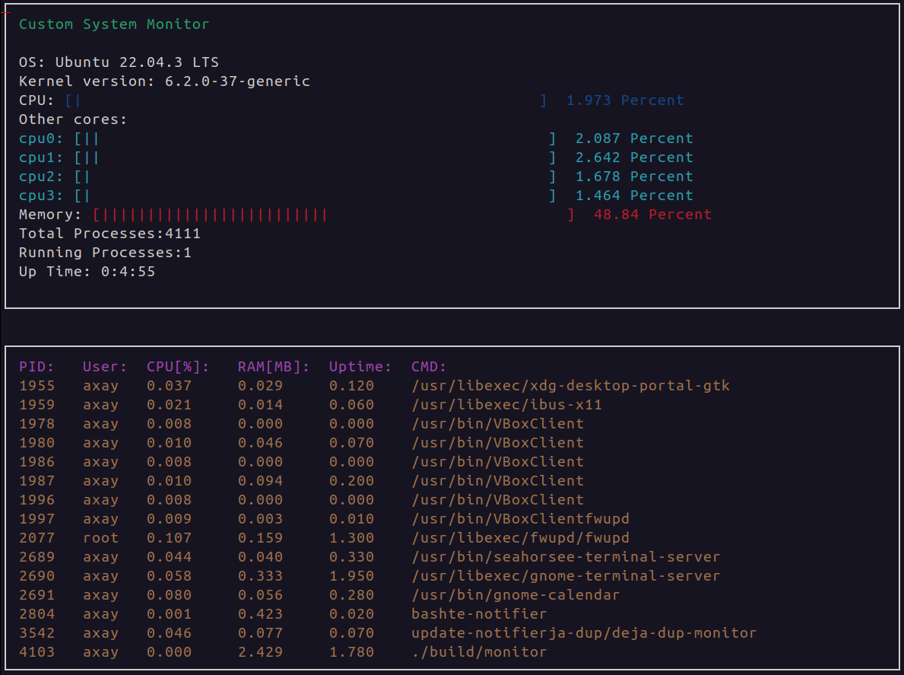

# System-Monitor

The System Monitor is a C++ project utilizing the `ncurses` library to provide real-time monitoring of system resources and processes on Unix-based systems. It offers a simple setup process, compiling with CMake, and displays essential information such as CPU usage and active processes in the terminal.



## To setup and compile:

1. Clone this repository and navigate to the project directory:
```
git clone https://github.com/akshaypatel774/System-Monitor.git
```
2. Install `ncurses` package
```
sudo apt-get install libncurses5-dev libncursesw5-dev
```
3. Create a build directory and navigate into it
```
mkdir build && cd build
```
4. Configure the build and Compile
```
cmake ..
make
```
5. Run the executable:
```
./monitor
```
6. In case of error that looks like the following: 
```
root@77e30fca8a01:/home/workspace/CppND-Object-Oriented# ./a.out
*** %n in writable segment detected ***
                                      Aborted (core dumped)
```
just keep trying `./monitor` and it should work eventually!

The program will continuously display system information and a list of processes, refreshing every second.

## Required Dependencies:
Make sure you have the following dependencies installed before compiling the project:

* `ncurses` library

Feel free to reach out for any questions or issues related to the System Monitor project!